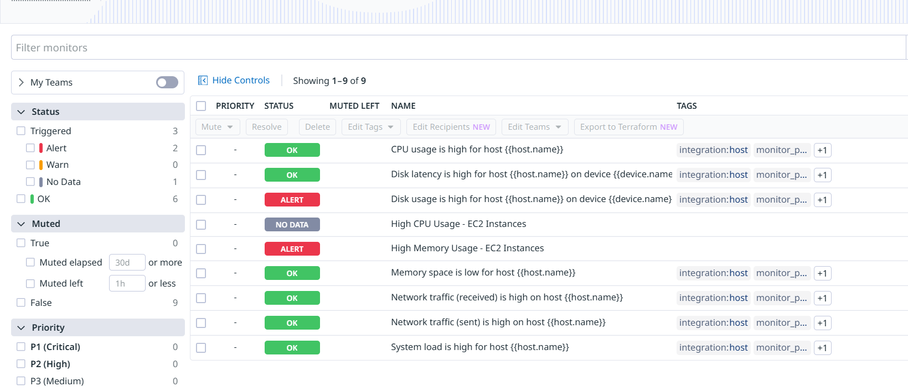
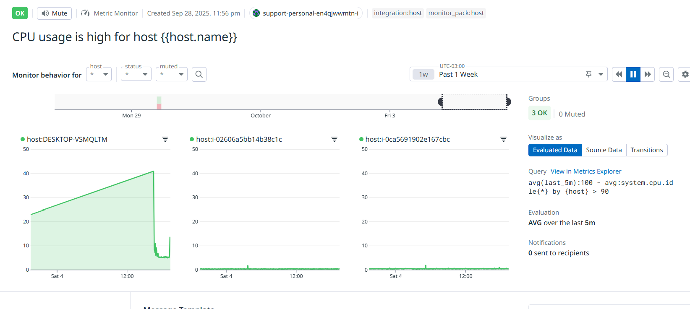
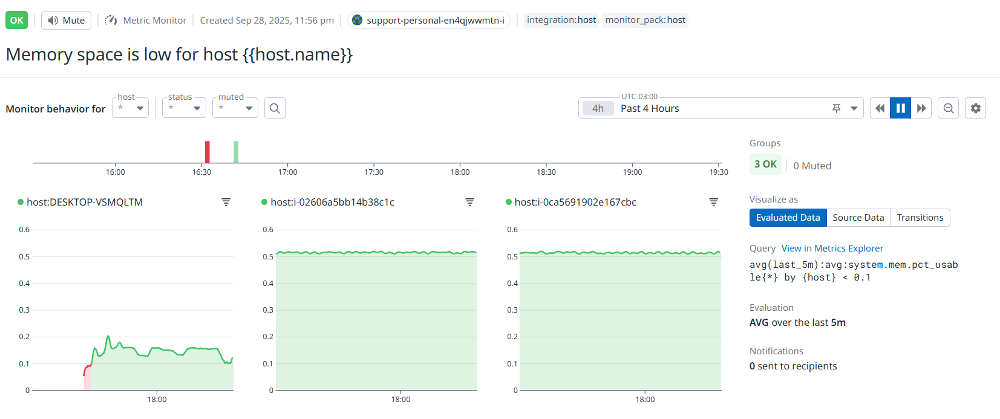
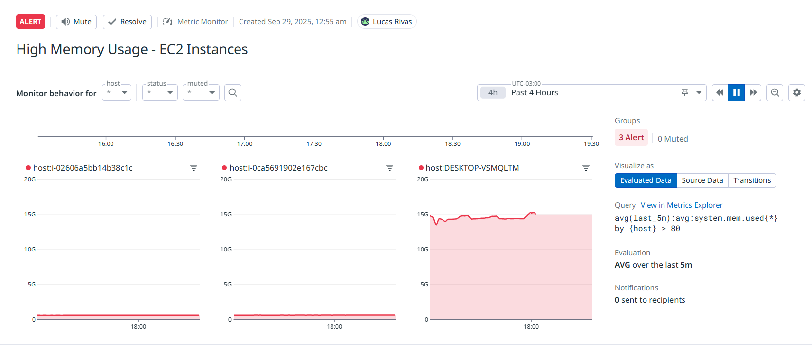
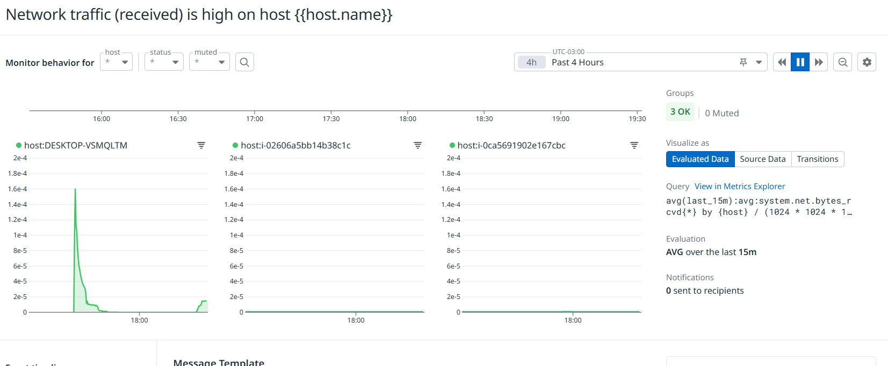
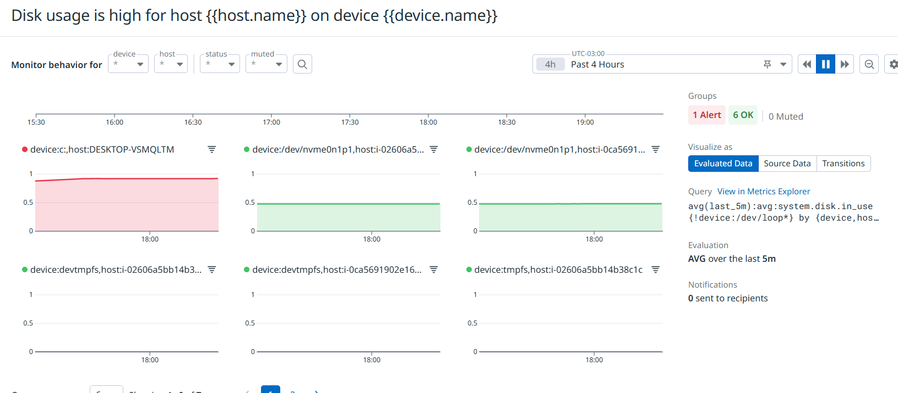
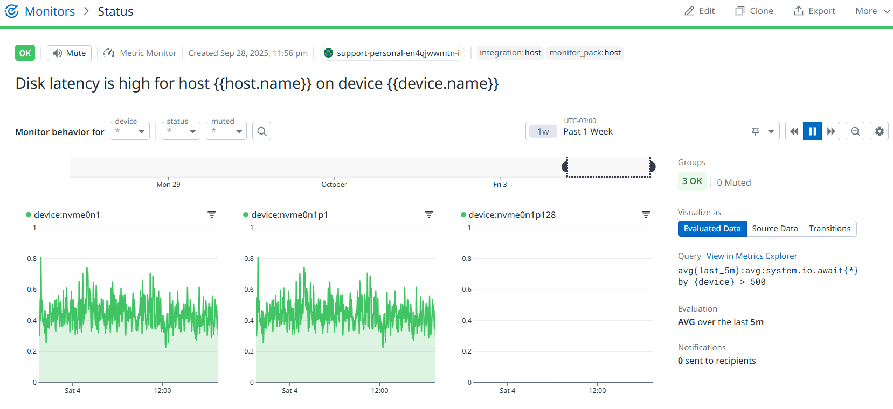
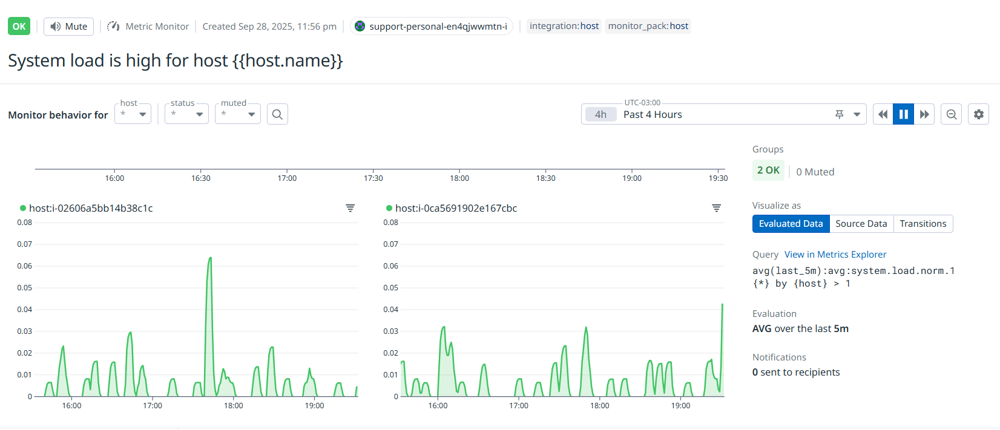

# AI4Devs Monitoring - Integración Datadog-AWS

Este proyecto extiende la infraestructura como código utilizando Terraform para implementar un canal de monitorización de Datadog en AWS. El ejercicio implementa técnicas de prompt engineering para automatizar la generación de código, permitiendo monitorear y obtener insights valiosos de la infraestructura AWS de manera automatizada.

## 📋 Objetivo del Ejercicio

Extender el código Terraform existente para:
- ✅ Configurar la integración de Datadog con AWS usando Terraform
- ✅ Instalar el agente Datadog en las instancias EC2
- ✅ Crear un dashboard en Datadog para visualizar métricas clave de AWS

## 🚀 Características Implementadas

### ✅ Integración AWS-Datadog
- Configuración completa del proveedor Datadog en Terraform
- IAM role con permisos necesarios para la integración
- Políticas personalizadas para métricas específicas de AWS
- Configuración de filtros por tags y external ID
- Integración con account ID: `275057777757`

### ✅ Agente Datadog en EC2
- Instalación automática del agente Datadog en ambas instancias
- Configuración para monitoreo de contenedores Docker
- Variables de entorno para API key y site
- Integración con scripts de user_data existentes
- Configuración de métricas de sistema y aplicación

### ✅ Dashboard de Monitoreo
- Dashboard completo con métricas clave de AWS
- Monitoreo de CPU, memoria, red y disco
- Métricas de contenedores Docker
- Widgets de resumen y tiempo de respuesta
- Layout ordenado con widgets de 12x8

### ✅ Alertas y Monitores
- Alerta de CPU alta (>80% crítico, >70% warning)
- Alerta de memoria alta (>80% crítico, >70% warning)
- Configuración de escalación y renotificación
- Monitores con umbrales de 5 minutos para evitar falsos positivos

## 📁 Estructura de Archivos

```
tf/
├── provider.tf              # Configuración de proveedores AWS y Datadog
├── variables.tf             # Variables de configuración
├── datadog.tf              # Integración AWS-Datadog
├── datadog_dashboard.tf    # Dashboard y monitores de Datadog
├── ec2.tf                  # Instancias EC2 (actualizado)
├── iam.tf                  # Roles y políticas IAM
├── s3.tf                   # Bucket S3
├── security_groups.tf       # Security groups
└── scripts/
    ├── backend_user_data.sh   # Script de inicialización backend (actualizado)
    └── frontend_user_data.sh  # Script de inicialización frontend (actualizado)
```

## 🔧 Configuración Inicial

### Prerrequisitos
- Cuenta AWS (capa gratuita)
- Terraform instalado
- Cuenta Datadog (prueba gratuita disponible)
- Credenciales AWS configuradas

### Variables Requeridas

Crea un archivo `terraform.tfvars` con tus credenciales:

```hcl
datadog_api_key = "tu_api_key_de_datadog"
datadog_app_key = "tu_app_key_de_datadog"
datadog_site    = "datadoghq.com"  # o tu región específica
```

### Despliegue

```bash
# Inicializar Terraform
terraform init

# Planificar cambios
terraform plan

# Aplicar configuración
terraform apply
```

## 📊 Dashboard de Datadog

El dashboard incluye las siguientes métricas:

### Métricas de Sistema
- **CPU Utilization**: Uso de CPU por instancia EC2
- **Memory Utilization**: Uso de memoria por host
- **Network Traffic**: Tráfico de red entrante y saliente
- **Disk Usage**: Lectura y escritura de disco

### Métricas de Aplicación
- **Docker Containers**: Estado de contenedores ejecutándose
- **Application Response Time**: Tiempo de respuesta de aplicaciones
- **Instance Count**: Total de instancias EC2

### 📸 Capturas de Pantalla del Dashboard

A continuación se muestran las capturas de pantalla del dashboard de Datadog con las métricas recogidas por el agente:

#### Dashboard Principal


#### Métricas de CPU


#### Métricas de Memoria




#### Métricas de Disco



#### Carga del Sistema


## 🚨 Alertas Configuradas

### CPU Alta
- **Warning**: >70% por 5 minutos
- **Critical**: >80% por 5 minutos
- **Mensaje**: "CPU usage is high on EC2 instance {{instance-id.name}}"

### Memoria Alta
- **Warning**: >70% por 5 minutos
- **Critical**: >80% por 5 minutos
- **Mensaje**: "Memory usage is high on host {{host.name}}"

### Salud de Contenedores
- **Critical**: Contenedor no ejecutándose
- **Mensaje**: "Docker container {{container_name.name}} is not running"

## 🔐 Seguridad

- Variables sensibles marcadas como `sensitive = true`
- External ID para la integración AWS-Datadog
- IAM role con permisos mínimos necesarios
- Políticas específicas para cada servicio AWS

## 📈 Métricas Monitoreadas

### AWS EC2
- `aws.ec2.cpuutilization`
- `aws.ec2.networkin` / `aws.ec2.networkout`
- `aws.ec2.diskreadbytes` / `aws.ec2.diskwritebytes`
- `aws.ec2.instance_count`

### Sistema
- `system.mem.used`
- `system.disk.used`

### Docker
- `docker.containers.running`
- `docker.containers.stopped`

### Application Load Balancer
- `aws.applicationelb.target_response_time`

## 🛠️ Troubleshooting

### Problemas Comunes

1. **Agente Datadog no se instala**
   - Verificar que las variables `datadog_api_key` y `datadog_site` estén configuradas
   - Revisar los logs de user_data en CloudWatch

2. **Métricas no aparecen en Datadog**
   - Verificar que la integración AWS esté configurada correctamente
   - Confirmar que el IAM role tenga los permisos necesarios

3. **Alertas no funcionan**
   - Verificar que los monitores estén activos en Datadog
   - Confirmar que las métricas estén llegando correctamente

### Logs Útiles

```bash
# Logs del agente Datadog
sudo journalctl -u datadog-agent -f

# Estado del agente
sudo datadog-agent status

# Configuración del agente
sudo datadog-agent config
```

## 📚 Documentación Adicional

- [Prompts utilizados](prompts/datadog-aws-prompts.md)
- [Documentación oficial de Datadog](https://docs.datadoghq.com/)
- [Terraform Datadog Provider](https://registry.terraform.io/providers/DataDog/datadog/latest/docs)

## 🤝 Contribuciones

Para contribuir al proyecto:

1. Crea una nueva rama con tus iniciales
2. Realiza los cambios necesarios
3. Actualiza la documentación
4. Crea un Pull Request

## 📝 Notas de Implementación

- El proyecto utiliza técnicas de prompt engineering para automatizar la generación de código
- La configuración es declarativa y reproducible
- Se mantiene compatibilidad con la infraestructura existente
- Se implementan mejores prácticas de seguridad y monitoreo

## 🚧 Desafíos Encontrados y Soluciones

### 1. **Configuración del Proveedor Datadog**
**Desafío**: El proveedor Datadog requería configuración específica con `datadog/datadog` en lugar de `hashicorp/datadog`
**Solución**: Actualizar la configuración del proveedor con la fuente correcta y versión compatible

### 2. **Integración AWS-Datadog**
**Desafío**: La sintaxis del recurso `datadog_integration_aws_account` cambió significativamente en versiones recientes
**Solución**: Adaptar la configuración a la nueva sintaxis con bloques anidados para `auth_config`, `aws_regions`, etc.

### 3. **Dashboard Layout**
**Desafío**: Los widgets del dashboard excedían el grid máximo de 12 columnas
**Solución**: Rediseñar el layout con widgets de 12x8 y distribución vertical

### 4. **Política IAM**
**Desafío**: La política `DatadogAWSIntegrationPolicy` no existía en AWS
**Solución**: Crear una política personalizada con todos los permisos necesarios para Datadog

### 5. **Monitores de Alertas**
**Desafío**: Los umbrales de los monitores no coincidían con las consultas
**Solución**: Ajustar los umbrales para que coincidan con los valores de las consultas (usar decimales)

### 6. **Instalación de Terraform**
**Desafío**: Terraform no se instaló correctamente en el PATH del sistema
**Solución**: Usar la ruta completa del ejecutable descargado

## 📊 Resultados Obtenidos

### Dashboard Creado
- **Título**: "AWS Infrastructure Monitoring - LTI Project"
- **ID**: `9qd-aeh-svt`
- **URL**: Disponible en Datadog Dashboard

### Monitores Activos
- **CPU Monitor ID**: `219885308`
- **Memory Monitor ID**: `219885309`

### Integración AWS
- **Account ID**: `275057777757`
- **Role**: `datadog-integration-role`
- **External ID**: Generado automáticamente por Datadog

## 🎯 Próximos Pasos

- [ ] Implementar métricas personalizadas de aplicación
- [ ] Configurar alertas por email/Slack
- [ ] Añadir monitoreo de logs de aplicación
- [ ] Implementar dashboards específicos por entorno
- [ ] Configurar métricas de costos AWS